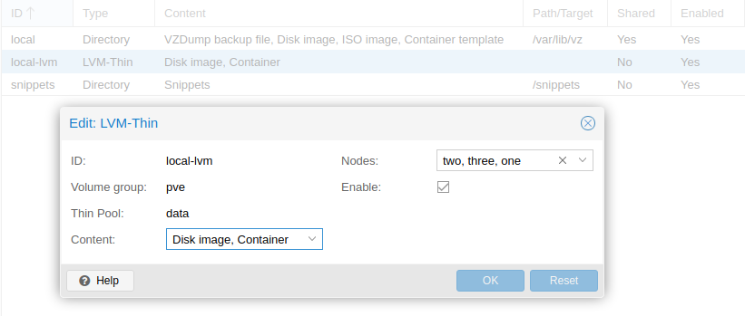

<div id="mHC" align="center">
  
</div>

<p align="center">The easy-way to create and manage a personal cloud envirnoment. mHC has been created using <strong>Shell</strong>, <a href="#Proxmox-VE"><strong>Proxmox-VE</strong></a>, <a href="#Packer"><strong>Packer</strong></a>, <a href="#Terraform"><strong>Terraform</strong></a>, <strong>Ansible</strong>, <a href="#MAAS"><strong>MAAS</strong></a> and is not completely reliable for <em><strong>Production</strong></em> environments.</p>

# <!-- omit in toc -->

## Table of Contents<!-- omit in toc -->

- [Proxmox-VE](#proxmox-ve)
  - [Installation - Manual Step](#installation---manual-step)
  - [Creating Ubuntu Image](#creating-ubuntu-image)
  - [Installation - Script Step - Creating cloud-init Template](#installation---script-step---creating-cloud-init-template)
  - [For Maximum Performance](#for-maximum-performance)
- [Packer](#packer)
  - [Installing Packer on Ubuntu Jump Server](#installing-packer-on-ubuntu-jump-server)
  - [Preparing Proxmox-VE template via Packer](#preparing-proxmox-ve-template-via-packer)
    - [Input Variables](#input-variables)
    - [`local` Variables](#local-variables)
- [Terraform](#terraform)
- [MAAS](#maas)
  
## Proxmox-VE

It is an open source **Server Virtualization Platform**. [Proxmox-VE][Proxmox-VE] includes two different virtualization technologies which are **Kernel-Based Virtual Machine *(KVM)*** and **Container-Based Virtualization *(LXC)***. *Proxmox-VE* can run on a **single node**, or **assemble a cluster of many nodes**. This way, your virtual machines and containers can run on Proxmox-VE with high availability.

<div id="mHC" align="center">
  
</div>

### Installation - Manual Step

- Download the installer *ISO image* from: [Proxmox-VE ISO Image][PVE-ISO]
- Create an *USB flash drive* and *Boot from USB*
  - [baleneEtcher][Etcher] is an easy way to create Proxmox-VE USB flash drive.

| Installing Proxmox VE |      |
| :-------------------- | :--- |
| *The Proxmox VE* menu will be displayed and select **Install Proxmox VE** to starts the normal installation.<br> [Click for more detail about Options][PVE-Installation] |  |
| After selecting **Install Proxmox VE** and *accepting* **the EULA**, the prompt to select **the target hard disk(s)** will appear. The **Options** button opens the dialog to select the target file system. In my instruction, we will select the *default file system **ext4***, different from the one in the screenshot.<br> The installer creates a *Volume Group **(VG)*** called **pve**, and additional *Logical Volumes **(LVs)*** called **root**, **data**, and **swap**. To control the size of these volumes use:<br> <ul><li>**hdsize:** The total hard disk size to be used (Mine: 223)</li><li>**swapsize:** Defines the size of the ***swap volume***. The default is the size of the installed memory, **minimum 4 GB** and **maximum 8 GB**. The resulting value cannot be **greater than *hdsize/8***. If set to **0**, ***no swap volume will be created*** (Mine: 4) </li><li>**maxroot:** Defines the maximum size of the **root** volume, which stores the operation system. The **maximum limit of the root volume size is *hdsize/4*** (Mine: 23)</li><li>**minfree:** Defines the amount of free space left in the LVM volume group **pve**. With more than *128GB* storage available the default is **16GB**, else ***hdsize/8*** will be used (Mine: 16)</li><li>**maxvz:** Defines the maximum size of the ***data*** volume. The actual size of the data volume is:<br> ***datasize = hdsize - rootsize - swapsize - minfree***<br> Where *datasize* cannot be bigger than ***maxvz*** (Mine: 180)</li></ul><br> [Click for more detail about Advanced LVM Options][PVE-LVM_Options] |  |
| After setting the disk options the next page asks for basic configuration options like the **location**, the **time zone**, and **keyboard** layout. *They only need to be changed in the rare case that **auto detection** fails or a **different keyboard layout** should be used.* |  |
| Next the *password* of the **superuser *(root)*** and an ***email*** address needs to be specified. The password must be at least **5** characters. However, it is highly recommended that you use a stronger password, so set a password that is at least **12 to 14** characters. The email address is used to send notifications to the system administrator. |  |
| The last step is the network configuration. Please note that during installation you can either use an IPv4 or IPv6 address, but not both. To configure a dual stack node, add additional IP addresses after the installation. *There will be created a proxmox cluster consisting of 3 physical servers. Therefore, 3 different network information is given below.*<ul><li>***Management Interface:*** **xx:xx:xx:xx:30:39** - **xx:xx:xx:xx:30:31** - **xx:xx:xx:xx:2f:04**</li><li>***Hostname(FQDN):*** **one.mhc.pve** - **two.mhc.pve** - **three.mhc.pve**</li><li>***IP Adress:*** **192.168.50.10** - **192.168.50.20** - **192.168.50.30**</li><li>***Netmask:*** **255.255.255.0**</li><li>***Gateway:*** **192.168.50.1**</li><li>***DNS Server:*** **192.168.50.1**</li></ul> |  |
| The next step shows a summary of the previously selected options. Re-check every setting and use the **Previous** button if a setting needs to be changed. To accept, press **Install**. The installation starts to format disks and copies packages to the target. Please wait until this step has finished; then **remove** the installation medium and **restart** your system.<br> Then point your browser to the IP address given during installation ***`https://youripaddress:8006`*** to reach **Proxmox Web Interface**.<br> Default login is **"root"** and the **root password** is defined(step 4) during the installation process. |  |

- After the installation is completed, the files which repositories are defined should be as follows in order to use APT Package Management tool successfully.
  - File /etc/apt/sources.list
    - `deb http://ftp.debian.org/debian buster main contrib`
    - `deb http://ftp.debian.org/debian buster-updates main contrib`
    - `deb http://security.debian.org/debian-security buster/updates main contrib`
    - `deb http://download.proxmox.com/debian/pve buster pve-no-subscription`
      - **Note:** PVE ***pve-no-subscription*** repository provided by *proxmox.com*, but NOT recommended for production use
- File /etc/apt/sources.list.d/pve-enterprise.list
  - `#deb https://enterprise.proxmox.com/debian/pve buster pve-enterprise`
- Then check `locale` if there is an error like "Cannot set LC_ALL(or others) to default locale: No such file or directory"
  - Run the following commands for each error
    - `echo "export LC_CTYPE=en_US.UTF-8" >> ~/.bashrc`
    - `echo "export LC_ALL=en_US.UTF-8" >> ~/.bashrc`
    - `source ~/.bashrc`
    - then run the following commands once
      - `locale-gen en_US en_US.UTF-8`
      - `dpkg-reconfigure locales` choose en_US.UTF-8
- Get latest updates
  - `apt update && apt upgrade -y && apt dist-upgrade`
- **RESTART/REBOOT** System
- For more information to [Create Proxmox-VE Cluster][Create Proxmox-VE Cluster]

---

### Creating Ubuntu Image

**Ubuntu ISO images** can be downloaded from [releases of Ubuntu][releases of Ubuntu]. For ***popular architectures***, please use ***releases of Ubuntu***. Also ***other Ubuntu images*** not found on releases of Ubuntu, such as builds for less popular architectures and other non-standard and unsupported images and daily build images, can downloaded from [the cdimage server][the cdimage server]. For old releases, see [old-releases of Ubuntu][old-releases of Ubuntu].

As of the Ubuntu LTS release in 2020, **the server documentation** has moved to [Ubuntu Server Guide][Ubuntu Server Guide]. However; the detailed **ubuntu latest LTS *installation guide*** can be found [here][Ubuntu Installation Guide].

Fully automated installations are possible on Ubuntu using [Ubuntu Installer(debian-installer)][Ubuntu Installer(debian-installer)] or [Ubuntu Live Server Installer(autoinstall)][Ubuntu Live Server Installer(autoinstall)].

- The Ubuntu Installer (based on the Debian Installer, and so often called simply **debian-installer** or just **d-i)** consists of a number of special-purpose components to perform each installation task. The debian-installer(*d-i)*) supports automating installs via **preconfiguration(*preseed.cfg*) files**. Preseeding method provides a way to set answers to questions asked during the installation process, without having to manually enter the answers while the installation is running. For more information visit [Automating the Installation using Preseeding][Automating the Installation using Preseeding], [Example Preseed File][Example Preseed File] and [Packer Preseed Ubuntu][Packer Preseed Ubuntu].
- However, Ubuntu [announced][Server installer plans for 20.04 LTS] that it will complete the transition to **the Live Server Installer**(*autoinstall)* with 20.04 LTS. It lets you answer all those configuration questions ahead of time with an ***autoinstall config*** and lets the installation process run without any interaction. The *autoinstall config* is provided via [cloud-init configuration][Cloud-Init-Config Documentation], which is almost endlessly flexible. [The live server installer is now the preferred media to install](https://wiki.ubuntu.com/FocalFossa/ReleaseNotes#Installer) Ubuntu Server on all architectures. For more information visit [Ubuntu Autoinstall Quick Start][Ubuntu Autoinstall Quick Start] and [Automated Server Installs Config File Reference][Automated Server Installs Config File Reference]

Ubuntu also offers ***Cloud Images***. [Ubuntu Cloud Images][Ubuntu Cloud Images] are the *official Ubuntu images* and are *pre-installed disk images* that have been customized by ***Ubuntu engineering to run on public clouds that provide Ubuntu Certified Images, Openstack, LXD, and more***. It will be used in [`create-template-via-cloudinit.sh`](#installation---script-step---creating-cloud-init-template) due to the **fast** and **easy** setup.

<details>
<summary><strong>To create Ubuntu Images via ISO without using Cloud-Images, the following repositories and articles can be viewed</strong></summary>

- [Automating Ubuntu 20.04 installs with Packer][Automating Ubuntu 20.04 installs with Packer]
- [Automating Ubuntu Server 20.04 with Packer][Automating Ubuntu Server 20.04 with Packer]
- [Packer build - Ubuntu Images(autoinstall & cloud-config)][Packer build - Ubuntu Images(autoinstall & cloud-config)]
- [Packer Ubuntu 20.04 Image(autoinstall & cloud-config)][Packer Ubuntu 20.04 Image(autoinstall & cloud-config)]
- [Madalynn Packer - Ubuntu Image(autoinstall & cloud-config)][Madalynn Packer - Ubuntu Image(autoinstall & cloud-config)]
- [Packer Proxmox Ubuntu Templates(ansible & preseed)][Packer Proxmox Ubuntu Templates(ansible & preseed)]
- [Packer Boxes(ansible & preseed)][Packer Boxes(ansible & preseed)]
- [Packer Proxmox Ubuntu Templates(preseed)][Packer Proxmox Ubuntu Templates(preseed)]
- [Packer Ubuntu Templates(preseed)][Packer Ubuntu Templates(preseed)]
- [Packer Templates for Ubuntu(preseed)][Packer Templates for Ubuntu(preseed)]
- [Automated image builds with Jenkins, Packer, and Kubernetes][Automated image builds with Jenkins, Packer, and Kubernetes]

</details>

---

<details>
<summary><strong>Creating Ubuntu Image Documents</strong></summary>

- **Install Ubuntu ISO images**
  - [releases of Ubuntu][releases of Ubuntu]
  - [the cdimage server][the cdimage server]
  - [old-releases of Ubuntu][old-releases of Ubuntu]
- [Ubuntu Server Guide][Ubuntu Server Guide]
- [Ubuntu Installer(debian-installer)][Ubuntu Installer(debian-installer)]
- [Ubuntu Live Server Installer(autoinstall)][Ubuntu Live Server Installer(autoinstall)]
- [Automating the Installation using Preseeding][Automating the Installation using Preseeding]
- [Example Preseed File][Example Preseed File]
- [Packer Preseed Ubuntu][Packer Preseed Ubuntu]
- [Server installer plans for 20.04 LTS][Server installer plans for 20.04 LTS]
- [Ubuntu Autoinstall Quick Start][Ubuntu Autoinstall Quick Start]
- [Automated Server Installs Config File Reference][Automated Server Installs Config File Reference]
- [Ubuntu Cloud Images][Ubuntu Cloud Images]
- [Ubuntu Enterprise Cloud - Images][Ubuntu Enterprise Cloud - Images]

</details>

---

### Installation - Script Step - Creating cloud-init Template

After installation to create cloud-init template(s) `create-template-via-cloudinit.sh` should be executed on Proxmox-VE Server(s). The script is based on the [create-cloud-template.sh][chriswayg-gist] developed by [chriswayg][chriswayg].

|     | `create-template-via-cloudinit.sh` Execution Prerequisites |
| :-: | :--------------------------------------------------------- |
|  1  |`create-template-via-cloudinit.sh` **should be executed on a Proxmox VE 6.x Server.** |
|  2  |A DHCP Server should be active on `vmbr0`. |
|  3  | **Download Latest Version of the Script on Proxmox VE Server:**<br> `curl https://raw.githubusercontent.com/BarisGece/mHC/main/proxmox-ve/create-template-via-cloudinit.sh > /usr/local/bin/create-template-via-cloudinit.sh && chmod -v +x /usr/local/bin/create-template-via-cloudinit.sh` |
|  4  | **-- Caution! MUST BE DONE to USE cloud-init-config.yml --**<br> The cloud-init files need to be stored in a **snippet**. There is not detail information very well documented in [Proxmox-VE qm cloud_init][Proxomox-VE qm cloud_init] but [Alex Williams][AW Gist] kept us well informed. <ol><li>Go to `Storage View -> Storage -> Add -> Directory`</li><li>Give it an ID such as `snippets`, and specify any path on your host such as `/snippets`</li><li>Under `Content` choose `Snippets` and de-select `Disk image` (optional)</li><li>Upload (scp/rsync/whatever) your `user-data, meta-data, network-config` files to your _proxmox_ server in `/snippets/snippets/` (the directory should be there if you followed steps 1-3)</li></ol> Finally, you just need to `qm set` with `--cicustom`, like this:(If `cloud-init-config.yml` is present, the following command will run automatically in `create-template-via-cloudinit.sh`)<br> `qm set 100 --cicustom "user=snippets:snippets/user-data,network=snippets:snippets/network-config,meta=snippets:snippets/meta-data"` |
|  5  | Prepare a cloudinit **user-cloud-init-config.yml** in the working directory. [sample-cloud-init-config.yml][sample-cloud-init-config.yml] can be used as a sample.<br> For more information [Cloud-Init-Config Sample][Cloud-Init-Config Sample]. |
|  6  | To the migration to be completed successfully, the Proxmox Storage Configuration should be set as follows.<br> **local**(*Type - Directory*):<ul><li>***Content:*** **VZDump backup file, Disk image, ISO image, Container template**</li><li>***Path/Target:*** **/var/lib/vz**</li><li>***Shared:*** **Yes**</li></ul> **local-lvm**(*Type - LVM-Thin*):<ul><li>***Content:*** **Disk image, Container**</li><li>***Nodes:*** **Select ALL Nodes by one by**</li></ul> **snippets**(*Type - Directory*):<ul><li>***Content:*** **Snippets**</li><li>***Path/Target:*** **/snippets**</li><li>***Nodes:*** **Select ALL Nodes by one by**</li></ul> *All of them should be **ENABLED***<br>   |
|  7  | Run the Script:<br> `$ create-template-via-cloudinit.sh` |
|  8  | Clone the Finished Template from the Proxmox GUI and Test. |

---

### For Maximum Performance

- **Network Device**
  - The **VirtIO paravirtualized NIC** should be used if you aim for **maximum performance**. Like all VirtIO devices, the guest OS should have the proper driver installed.
  - The **VirtIO model** provides the ***best performance*** with very **low CPU overhead**. If your guest does not support this driver, it is usually best to **use e1000**.
  - `qm create 9000 --memory 2048 --net0 virtio,bridge=vmbr0`
- **Hard Disk -- Bus/Controller -- Cache**
  - If you aim at **maximum performance**, you can select a **SCSI** controller of type **VirtIO SCSI single** which will allow you to select the IO Thread option.
  - **cache=none** seems to be the best performance and is the default since Proxmox 2.X. However, **cache=unsafe** doesn't flush data, so it's ***fastest*** but ***unsafest***. The information is based on using **raw volumes**, other volume formats may behave differently. For more information [Performance Tweaks][Performance Tweaks].
  - Use **raw disk** image instead of **qcow2** if possible
  - `qm importdisk 9000 /tmp/VMIMAGE local-lvm --format raw`
  - `qm set 9000 --scsihw virtio-scsi-single --scsi0 local-lvm:vm-9000-disk-0,iothread=1`
- **CPU Types**
  - If you have a ***homogeneous cluster where all nodes have the same CPU***, set the **CPU type** to **host**, as in theory this will give your guests maximum performance.
  - `qm set 9000 --cpu host`
- **NUMA(*non-uniform memory access*)**
  - With NUMA, **memory** can be evenly *distributed among CPUs*, which improves performance. Also, to enable **CPU** and **Memory** *hot-plugging* in Proxmox-VE, *NUMA* option should be *enabled*. To enable NUMA option on VM execute the following **command**.
    - `qm set --kvm 1 numa 1`
  - If the following **command** returns ***more than one node***, then your host system has a **NUMA** architecture.
    - `numactl --hardware | grep available`
    - `numactl --hardware`
  - This command will show all the nodes in the cluster that are NUMA aware and their performance stats.
    - `numastat`
- **HOT-PLUGGING**
  - The **hotplugging** feature provides the ability to **add** or **remove** devices or resources from the Virtual Machine ***without rebooting***. To enable **hotplug** execute the following **command**.
    - qm set --hotplug disk,network,usb,memory,cpu
  - **NUMA** option **MUST be ENABLED**.
  - ***Preparing Linux Guests***
    - A kernel newer than **4.7** is recommended for Linux Guests for all hotplugging features to work.
    - The following **kernel modules should bu installed** on **Linux Guests**. To automatically load the modules during boot, add them into **`/etc/modules`**. The automate command was added to `sample-cloud-init-config.yml`<br>Caution! Lines beginning with "#" are ignored.
      - `# modprobe acpiphp` <br> `# modprobe pci_hotplug`
    - After kernel **4.7**, ***only*** the following kernel parameter should be added to `/etc/default/grub` ***during boot*** for the **CPU**. It also added to `sample-cloud-init-config.yml`.
      - `GRUB_CMDLINE_LINUX_DEFAULT="quiet splash memhp_default_state=online"`
    - Update the **grub boot loader**
      - `sudo update-grub`
    - **REBOOT Linux Guest**
    - Sample command for **hotplugging vCPUs**
      - `qm set 9000 -vcpus 4`
    - | Device | Kernel | Hotplug       | Unplug        | OS                         |
      | :----: | :----: | :-----------: | :-----------: | :------------------------: |
      | Disk   | All    | Linux/Windows | Linux/Windows | Linux/Windows              |
      | NIC    | All    | Linux/Windows | Linux/Windows | Linux/Windows              |
      | USB    | All    | Linux/Windows | Linux/Windows | Linux/Windows              |
      | CPU    | 3.10+  | Linux/Windows | Linux(4.10+)  | Linux/Windows Server 2008+ |
      | Memory | 3.10+  | Linux/Windows | Linux(4.10+)  | Linux/Windows Server 2008+ |

---

<details>
<summary><strong>Proxmox-VE Documents</strong></summary>

- [Admin Guide - PDF][Admin Guide - PDF]
- [Admin Guide - HTML][Admin Guide - HTML]
- [Wiki Page][Wiki Page]
- [Qemu/KVM(qm) Virtual Machines-Guide][Qemu/KVM(qm) Virtual Machines-Guide]
- [Qemu/KVM(qm) VM Templates-Wiki][Qemu/KVM(qm) VM Templates-Wiki]
- [Proxomox-VE qm Commands][Proxomox-VE qm Command Line Interface]
- [Proxmox(qm) Cloud-Init Support-Guide][Proxmox(qm) Cloud-Init Support-Guide]
- [Proxmox(qm) Cloud-Init Support-Wiki][Proxmox(qm) Cloud-Init Support-Wiki]
- [Proxmox(qm) Cloud-Init Support FAQ-Wiki][Proxmox(qm) Cloud-Init Support FAQ-Wiki]
- [Cloud-Init-Config Sample][Cloud-Init-Config Sample]
- [Cloud-Init-Config Documentation][Cloud-Init-Config Documentation]
- [Performance Tweaks][Performance Tweaks]
- [Virtio Balloon][Virtio Balloon]
- [NUMA][NUMA]
- [Hotplug][Hotplug]
- [Ansible role to configure Proxmox server][Ansible role to configure Proxmox server]

</details>

---

## Packer

Packer is an **automatic machine image generation** tool and ***Proxmox-VE templates*** will be created with ***Packer*** to make it more standardized and automated.

### Installing Packer on Ubuntu Jump Server

- Add the HashiCorp GPG key.
  - `curl -fsSL https://apt.releases.hashicorp.com/gpg | sudo apt-key add -`
- Add the official HashiCorp Linux repository.
  - `sudo apt-add-repository "deb [arch=amd64] https://apt.releases.hashicorp.com $(lsb_release -cs) main"`
- Update and install.
  - `sudo apt-get update && sudo apt-get install packer`

### Preparing Proxmox-VE template via Packer

[Packer Proxmox Builder][Packer Proxmox Builder] will be used to create the *Proxmox-VE template*. It provision and configure the VM and then converts it into a template. *Packer Proxmox Builder* perfoms operations via the [Proxmox Web API][Proxmox Web API].

Packer Proxmox Builder is able to create new images using both **ISO**([proxmox-iso][proxmox-iso]) and existing **Cloud-Init Images**([proxmox-clone][proxmox-clone]). Creating a new image using ([proxmox-iso][proxmox-iso]) will be developed later.

Now, **Proxmox-VE templates** will be created with **proxmox-clone** using **existing Cloud-Init Images** created via `create-template-via-cloudinit.sh`.

|     | Packer Execution Prerequisites |
| :-: | :----------------------------- |
|  1  |To skip validating the certificate set `insecure_skip_tls_verify = true` in **sources.pkr.hcl** |
|  2  |To Packer run sucessfully `qemu-guest-agent` must be installed on VMs & `qemu_agent = ...` configuration option should be `true` in `sources.pkr.hcl`<br> For more detail [Error getting SSH address 500 QEMU guest agent is not running][QEMU Agent Error-Github]|

#### Input Variables

In Packer, ***Assigning Values* to the build Variables** with *HCL2* can be done in **3** different ways as follows  

- **Command-line flags**
  - Variables can be defined directly on the *command line* with the `-var` flag. We will not use.
    - `packer build -var 'weekday=Sunday' -var 'flavor=chocolate'`
- **Variables file**
  - To persist variable values, create a `*.pkrvars.hcl` file and assign variables within this file. Also, packer will **automatically load any var file** that matches the name `*.auto.pkrvars.hcl`, without the need to pass the file via the command line.
    - `*.pkrvars.hcl` => `packer build -var-file="*.pkrvars.hcl" .`
    - `*.auto.pkrvars.hcl` => `packer build .`
- **Environment Variables**
  - Packer will read ***environment variables*** in the form of `PKR_VAR_name` to find the value for a variable.
    - `export PKR_VAR_access_key=Key1 && packer build .`
- **Variable Defaults**
  - If no value is assigned to a variable via any of these methods and the variable has a `default` key in its declaration, that value will be used for the variable.
    - `packer build .`
- **Notes about Packer Variables**
  - Don't save **sensitive data** to version control via *varibles files*. You can create a **local secret variables file** or use **environment variables**
  - **Multiple** `-var-file` flags can be provided.<br>`packer build -var-file="secret.pkrvars.hcl" -var-file="production.pkrvars.hcl" .`
  - If a **default value** is set in `variables.pkr.hcl`, the *variable is optional*. Otherwise, the *variable must be set*. To force set variables don't set **default value** as `variable "vm_id" {...}` in  `variables.pkr.hcl`
  - The `variable` block, also called the `input-variable` block, defines variables within your *Packer* configuration.
  - **Debug** => `PACKER_LOG=1 packer build -debug -on-error=ask .`<br> **Release** => `PACKER_LOG=1 packer build .`

#### `local` Variables

An `input-variable` cannot be used in **another input variable**, so [locals][The locals block] could be used instead. The `locals` **block**, also called the `local-variable` **block**, defines locals within your Packer configuration. [Local Values][Local Values] assign a name to an expression, that can then be used multiple times within a folder.

```sh
# locals.pkr.hcl
locals {
    # locals can be bare values like:
    wee = local.baz
    # locals can also be set with other variables :
    baz = "Foo is '${var.foo}' but not '${local.wee}'"
}
```

<details>
<summary><strong>Packer Documents</strong></summary>

- [Packer Proxmox Builder][Packer Proxmox Builder]
- [proxmox-clone][proxmox-clone] **&** [proxmox-iso][proxmox-iso]
- [Input Variables and `local` variables][Input Variables and local variables]
  - [The `variable` block][The variable block]
  - [Input Variables][Input Variables]
  - [The `locals` block][The locals block]
  - [Local Values][Local Values]
- [Creating Proxmox Templates with Packer - Aaron Berry][Aaron Berry Packer Article]
  - [Article Github Repo][Aaron Berry Article Repo]

</details>

---

## Terraform

[Terraform][Terraform] is an **Infrastructure as Code** tool to securely and efficiently provision, manage, and version infrastructure. Having more than **1000** [Modules][Terraform Modules] and more than **200** [Providers][Terraform Providers] makes it easy to manage existing and popular infrastructure, cloud or service providers as well as *custom on-premises solutions*.

---

## MAAS

[MAAS][MAAS] is a **Metal as a Service** that allows you to treat physical servers in the Cloud like VM Instances. It turns bare metal into a flexible cloud-like resource, so there is no need to manage servers individually. For more information [MAAS Docs][MAAS Docs] **&** [Proxmox - MAAS - JuJu by VectOps][Proxmox - MAAS - JuJu by VectOps]

[Proxmox-VE]:                                                    https://www.proxmox.com/
[PVE-ISO]:                                                       https://www.proxmox.com/en/downloads/category/iso-images-pve
[Etcher]:                                                        https://www.balena.io/etcher/
[PVE-Installation]:                                              https://pve.proxmox.com/pve-docs/pve-admin-guide.html#chapter_installation
[PVE-LVM_Options]:                                               https://pve.proxmox.com/pve-docs/pve-admin-guide.html#advanced_lvm_options
[Create Proxmox-VE Cluster]:                                     https://pve.proxmox.com/pve-docs/pve-admin-guide.html#pvecm_create_cluster
[releases of Ubuntu]:                                            https://releases.ubuntu.com/
[the cdimage server]:                                            https://cdimage.ubuntu.com/
[old-releases of Ubuntu]:                                        https://old-releases.ubuntu.com/
[Ubuntu Server Guide]:                                           https://ubuntu.com/server/docs
[Ubuntu Installation Guide]:                                     https://help.ubuntu.com/lts/installation-guide
[Ubuntu Installer(debian-installer)]:                            https://help.ubuntu.com/lts/installation-guide/amd64/ch06s01.html
[Ubuntu Live Server Installer(autoinstall)]:                     https://ubuntu.com/server/docs/install/autoinstall
[Automating the Installation using Preseeding]:                  https://help.ubuntu.com/lts/installation-guide/amd64/apb.html
[Example Preseed File]:                                          https://help.ubuntu.com/lts/installation-guide/example-preseed.txt
[Packer Preseed Ubuntu]:                                         https://www.packer.io/guides/automatic-operating-system-installs/preseed_ubuntu.html
[Server installer plans for 20.04 LTS]:                          https://discourse.ubuntu.com/t/server-installer-plans-for-20-04-lts/13631
[Cloud-Init-Config Documentation]:                               https://cloudinit.readthedocs.io/en/latest/
[Ubuntu Autoinstall Quick Start]:                                https://ubuntu.com/server/docs/install/autoinstall-quickstart
[Automated Server Installs Config File Reference]:               https://ubuntu.com/server/docs/install/autoinstall-reference
[Ubuntu Cloud Images]:                                           https://cloud-images.ubuntu.com/
[Ubuntu Enterprise Cloud - Images]:                              https://help.ubuntu.com/community/UEC/Images
[Automating Ubuntu 20.04 installs with Packer]:                  https://nickcharlton.net/posts/automating-ubuntu-2004-installs-with-packer.html
[Automating Ubuntu Server 20.04 with Packer]:                    https://beryju.org/blog/automating-ubuntu-server-20-04-with-packer
[Packer build - Ubuntu Images(autoinstall & cloud-config)]:      https://github.com/tylert/packer-build
[Packer Ubuntu 20.04 Image(autoinstall & cloud-config)]:         https://github.com/nickcharlton/packer-ubuntu-2004
[Madalynn Packer - Ubuntu Image(autoinstall & cloud-config)]:    https://github.com/aerialls/madalynn-packer
[Packer Proxmox Ubuntu Templates(ansible & preseed)]:            https://github.com/chriswayg/packer-proxmox-templates
[Packer Boxes(ansible & preseed)]:                               https://github.com/geerlingguy/packer-boxes/blob/master/ubuntu2004/box-config.json
[Packer Proxmox Ubuntu Templates(preseed)]:                      https://github.com/Aaron-K-T-Berry/packer-ubuntu-proxmox-template
[Packer Ubuntu Templates(preseed)]:                              https://github.com/chef/bento/tree/master/packer_templates/ubuntu
[Packer Templates for Ubuntu(preseed)]:                          https://github.com/boxcutter/ubuntu
[Automated image builds with Jenkins, Packer, and Kubernetes]:   https://cloud.google.com/solutions/automated-build-images-with-jenkins-kubernetes
[chriswayg]:                                                     https://github.com/chriswayg
[chriswayg-gist]:                                                https://gist.github.com/chriswayg/43fbea910e024cbe608d7dcb12cb8466
[Proxomox-VE qm cloud_init]:                                     https://pve.proxmox.com/pve-docs/pve-admin-guide.html#qm_cloud_init
[AW Gist]:                                                       https://gist.github.com/aw/ce460c2100163c38734a83e09ac0439a
[sample-cloud-init-config.yml]:                                  https://raw.githubusercontent.com/BarisGece/mHC/main/proxmox-ve/sample-cloud-init-config.yml
[Cloud-Init-Config Sample]:                                      https://cloudinit.readthedocs.io/en/latest/topics/examples.html#yaml-examples
[Admin Guide - PDF]:                                             https://proxmox.com/en/downloads/item/proxmox-ve-admin-guide-for-6-x
[Admin Guide - HTML]:                                            https://pve.proxmox.com/pve-docs/pve-admin-guide.html
[Wiki Page]:                                                     https://pve.proxmox.com/wiki/Main_Page
[Qemu/KVM(qm) Virtual Machines-Guide]:                           https://pve.proxmox.com/pve-docs/pve-admin-guide.html#chapter_virtual_machines
[Qemu/KVM(qm) VM Templates-Wiki]:                                https://pve.proxmox.com/wiki/Qemu/KVM_Virtual_Machines#qm_templates
[Proxomox-VE qm Command Line Interface]:                         https://pve.proxmox.com/pve-docs/qm.1.html
[Proxmox(qm) Cloud-Init Support-Guide]:                          https://pve.proxmox.com/pve-docs/pve-admin-guide.html#qm_cloud_init
[Proxmox(qm) Cloud-Init Support-Wiki]:                           https://pve.proxmox.com/wiki/Cloud-Init_Support
[Proxmox(qm) Cloud-Init Support FAQ-Wiki]:                       https://pve.proxmox.com/wiki/Cloud-Init_FAQ
[Performance Tweaks]:                                            https://pve.proxmox.com/wiki/Performance_Tweaks
[Virtio Balloon]:                                                https://rwmj.wordpress.com/2010/07/17/virtio-balloon/
[NUMA]:                                                          https://pve.proxmox.com/wiki/NUMA
[Hotplug]:                                                       https://pve.proxmox.com/wiki/Hotplug_(qemu_disk,nic,cpu,memory)
[Ansible role to configure Proxmox server]:                      https://github.com/chriswayg/ansible-proxmox
[Packer Proxmox Builder]:                                        https://www.packer.io/docs/builders/proxmox.html
[Proxmox Web API]:                                               https://pve.proxmox.com/wiki/Proxmox_VE_API
[proxmox-clone]:                                                 https://www.packer.io/docs/builders/proxmox/clone
[proxmox-iso]:                                                   https://www.packer.io/docs/builders/proxmox/iso
[QEMU Agent Error-Github ]:                                      https://github.com/hashicorp/packer/issues/9539#issuecomment-728378170
[The locals block]:                                              https://www.packer.io/docs/from-1.5/blocks/locals
[Local Values]:                                                  https://www.packer.io/docs/from-1.5/locals
[Input Variables and local variables]:                           https://www.packer.io/guides/hcl/variables
[The variable block]:                                            https://www.packer.io/docs/from-1.5/blocks/variable
[Input Variables]:                                               https://www.packer.io/docs/from-1.5/variables
[Aaron Berry Packer Article]:                                    https://dev.to/aaronktberry/creating-proxmox-templates-with-packer-1b35
[Aaron Berry Article Repo]:                                      https://github.com/Aaron-K-T-Berry/packer-ubuntu-proxmox-template
[Terraform]:                                                     https://www.terraform.io/
[Terraform Modules]:                                             https://registry.terraform.io/
[Terraform Providers]:                                           https://www.terraform.io/docs/providers/
[Terraform Introduction]:                                        https://www.terraform.io/intro/index.html
[Terraform Documentation]:                                       https://www.terraform.io/docs/index.html
[MAAS]:                                                          https://maas.io/
[MAAS Docs]:                                                     https://maas.io/docs
[Proxmox - MAAS - JuJu by VectOps]:                              https://vectops.com/2020/02/production-ready-kubernetes-paas-in-10-steps-iaas-included/
