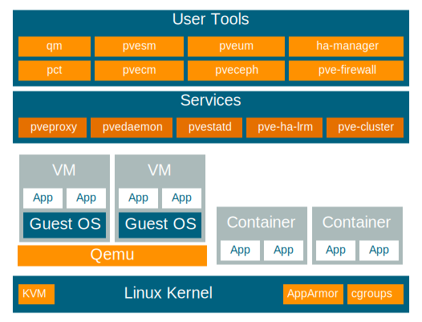
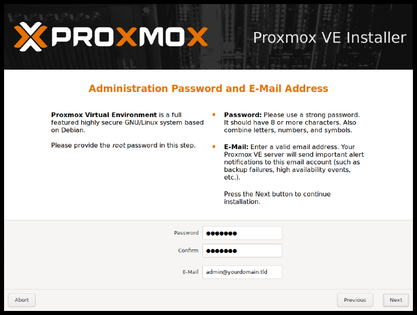

# mHC

The easy-way to create and manage a Mini Home Cloud. mHC is built using [Proxmox-VE](#Proxmox-VE), Terraform, Packer and is not completely reliable for PROD environments.

## Proxmox-VE

It is an Open Source **Server Virtualization Platform**. *Proxmox-VE* includes two different virtualization technologies which are **Kernel-Based Virtual Machine *(KVM)*** and **Container-Dased Virtualization *(LXC)***. *Proxmox-VE* can run on a **single node**, or **assemble a cluster of many nodes**. This way, your virtual machines and containers can run on proxmox with high availability.

### Installation - Manual Step

* Download the installer *ISO image* from: [Proxmox-VE ISO Image][PVE-ISO]
* Create an *USB flash drive* and *Boot from USB*
  * [baleneEtcher][Etcher] is an easy way to create Proxmox-VE USB flash drive.
* | Installing Proxmox VE |       |
  | :-------------------- | :--- |
  | *The Proxmox VE* menu will be displayed and select **Install Proxmox VE** to starts the normal installation.  [Click for more detail about Options][PVE-Installation] ||
  | After selecting **Install Proxmox VE** and *accepting* **the EULA**, the prompt to select **the target hard disk(s)** will appear. The **Options** button opens the dialog to select the target file system. In my instruction,we will select the *default file system **ext4***, different from the one in the picture.  The installer creates a *Volume Group **(VG)*** called **pve**, and additional *Logical Volumes **(LVs)*** called **root**, **data**, and **swap**. To control the size of these volumes use:  <ul><li>**hdsize:** The total hard disk size to be used (Mine: 223)</li><li>**swapsize:** Defines the size of the ***swap volume***. The default is the size of the installed memory, **minimum 4 GB** and **maximum 8 GB**. The resulting value cannot be **greater than *hdsize/8***. If set to **0**, ***no swap volume will be created*** (Mine: 4) </li><li>**maxroot:** Defines the maximum size of the **root** volume, which stores the operation system. The **maximum limit of the root volume size is *hdsize/4*** (Mine: 23)</li><li>**maxvz:** Defines the maximum size of the ***data*** volume. The actual size of the data volume is:  ***datasize = hdsize - rootsize - swapsize - minfree***  Where *datasize* cannot be bigger than ***maxvz*** (Mine: 180)</li><li>**minfree:** Defines the amount of free space left in the LVM volume group **pve**. With more than *128GB* storage available the default is **16GB**, else ***hdsize/8*** will be used (Mine: 16)</li></ul>  [Click for more detail about Advanced LVM Options][PVE-LVM_Options] |  |
  | After setting the disk options the next page asks for basic configuration options like the **location**, the **time zone**, and **keyboard** layout. *They only need to be changed in the rare case that **auto detection** fails or a **different keyboard layout** should be used.* |  |
  | Next the *password* of the **superuser *(root)*** and an ***email*** address needs to be specified. The password must be at least **5** characters. However, it is highly recommended that you use a stronger password, so set a password that is at least **12 to 14** characters. The email address is used to send notifications to the system administrator. |  |
  | The last step is the network configuration. Please note that during installation you can either use an IPv4 or IPv6 address, but not both. To configure a dual stack node, add additional IP addresses after the installation. *There will be created a proxmox cluster consisting of 3 physical servers. Therefore, 3 different network information is given below.*<ul><li>***Management Interface:*** **xx:xx:xx:xx:30:39** - **xx:xx:xx:xx:30:31** - **xx:xx:xx:xx:2f:04**</li><li>***Hostname(FQDN):*** **one.rancher.pve** - **two.rancher.pve** - **three.rancher.pve**</li><li>***IP Adress:*** **192.168.50.10** - **192.168.50.20** - **192.168.50.30**</li><li>***Netmask:*** **255.255.255.0**</li><li>***Gateway:*** **192.168.50.1**</li><li>***DNS Server:*** **192.168.50.1**</li></ul> |  |
  | The next step shows a summary of the previously selected options. Re-check every setting and use the **Previous** button if a setting needs to be changed. To accept, press **Install**. The installation starts to format disks and copies packages to the target. Please wait until this step has finished; then **remove** the installation medium and **restart** your system.  Then point your browser to the IP address given during installation ***`https://youripaddress:8006`*** to reach **Proxmox Web Interface**.  Default login is **"root"** and the **root password** is defined during the installation process. |  |
* After the installation is completed, the files which repositories are defined should be as follows in order to use APT Package Management tool successfully.
  * File /etc/apt/sources.list
    * `deb http://ftp.debian.org/debian buster main contrib`
    * `deb http://ftp.debian.org/debian buster-updates main contrib`
    * `deb http://security.debian.org/debian-security buster/updates main contrib`
    * `deb http://download.proxmox.com/debian/pve buster pve-no-subscription`
      * **Note:** PVE ***pve-no-subscription*** repository provided by *proxmox.com*, but NOT recommended for production use
* File /etc/apt/sources.list.d/pve-enterprise.list
  * `#deb https://enterprise.proxmox.com/debian/pve buster pve-enterprise`
* Then check `locale` if there is a warning like "Cannot set LC_ALL(or others) to default locale: No such file or directory"
  * Run the following command for each
    * `echo "export LC_CTYPE=en_US.UTF-8" >> ~/.bashrc`
    * `echo "export LC_ALL=en_US.UTF-8" >> ~/.bashrc`
    * `source ~/.bashrc`
    * then run the following command once
      * `locale-gen en_US en_US.UTF-8`
      * `dpkg-reconfigure locales` choose en_US.UTF-8
* Get latest Updates
  * `apt update && apt upgrade -y && apt dist-upgrade`
* **RESTART/REBOOT** System

### Installation - Script Step - Creating cloud-init Template

To create cloud-init template(s) `create-template-via-cloudinit.sh` should be executed on Proxmox-VE Server(s). The script is based on the [create-cloud-template.sh][chriswayg-gist] developed by [chriswayg][chriswayg].

|  No | `create-template-via-cloudinit.sh` Execution Prerequisites |
| :-: | :--------------------------------------------------------- |
|  1  |`create-template-via-cloudinit.sh` **should be executed on a Proxmox VE 6.x Server.** |
|  2  |A DHCP Server should be active on `vmbr0`. |
|  3  | **Download Latest Version of the Script on Proxmox VE Server:**  `curl https://raw.githubusercontent.com/BarisGece/mHC/main/proxmox-ve/create-template-via-cloudinit.sh > /usr/local/bin/create-template-via-cloudinit.sh && chmod -v +x /usr/local/bin/create-template-via-cloudinit.sh` |
|  4  | (optionally) Prepare a cloudinit **user-config.yml** in the working directory. For more information [Cloud-Init-Config Sample][Cloud-Init-Config Sample].  This could be copied and modified from the cloudinit user dump at the end of this script. |
|  5  | Run the Script:  `$ create-template-via-cloudinit.sh` |
|  6  | Clone the Finished Template from the Proxmox GUI and Test. |
|  7  | To the migration to be completed successfully, the Proxmox Storage Configuration should be set as follows.  **local**(*Type - Directory*):<ul><li>***Content:*** **VZDump backup file, Disk image, ISO image, Container template**</li><li>***Path/Target:*** **/var/lib/vz**</li><li>***Shared:*** **Yes**</li></ul> **local-lvm**(*Type - LVM-Thin*):<ul><li>***Content:*** **Disk image, Container**</li><li>***Nodes:*** **Select ALL Nodes by one by**</li></ul> *All of them should be **ENABLED***    |

### Documentations

* [Admin Guide - PDF][Admin Guide - PDF]
* [Admin Guide - HTML][Admin Guide - HTML]
* [Wiki Page][Wiki Page]
* [Qemu/KVM(qm) Virtual Machines-Guide][Qemu/KVM(qm) Virtual Machines-Guide]
* [Qemu/KVM(qm) VM Templates-Wiki][Qemu/KVM(qm) VM Templates-Wiki]
* [Proxomox-VE qm Commands][Proxomox-VE qm Command Line Interface]
* [Proxmox(qm) Cloud-Init Support-Guide][Proxmox(qm) Cloud-Init Support-Guide]
* [Proxmox(qm) Cloud-Init Support-Wiki][Proxmox(qm) Cloud-Init Support-Wiki]
* [Proxmox(qm) Cloud-Init Support FAQ-Wiki][Proxmox(qm) Cloud-Init Support FAQ-Wiki]
* [Cloud-Init-Config Sample][Cloud-Init-Config Sample]

[PVE-ISO]:                                  https://www.proxmox.com/en/downloads/category/iso-images-pve
[Etcher]:                                   https://www.balena.io/etcher/
[PVE-Installation]:                         https://pve.proxmox.com/pve-docs/pve-admin-guide.html#chapter_installation
[PVE-LVM_Options]:                          https://pve.proxmox.com/pve-docs/pve-admin-guide.html#advanced_lvm_options
[chriswayg]:                                https://github.com/chriswayg
[chriswayg-gist]:                           https://gist.github.com/chriswayg/43fbea910e024cbe608d7dcb12cb8466
[Admin Guide - PDF]:                        https://proxmox.com/en/downloads/item/proxmox-ve-admin-guide-for-6-x
[Admin Guide - HTML]:                       https://pve.proxmox.com/pve-docs/pve-admin-guide.html
[Wiki Page]:                                https://pve.proxmox.com/wiki/Main_Page
[Qemu/KVM(qm) Virtual Machines-Guide]:      https://pve.proxmox.com/pve-docs/pve-admin-guide.html#chapter_virtual_machines
[Qemu/KVM(qm) VM Templates-Wiki]:           https://pve.proxmox.com/wiki/Qemu/KVM_Virtual_Machines#qm_templates
[Proxmox(qm) Cloud-Init Support-Guide]:     https://pve.proxmox.com/pve-docs/pve-admin-guide.html#qm_cloud_init
[Proxmox(qm) Cloud-Init Support-Wiki]:      https://pve.proxmox.com/wiki/Cloud-Init_Support
[Proxmox(qm) Cloud-Init Support FAQ-Wiki]:  https://pve.proxmox.com/wiki/Cloud-Init_FAQ
[Cloud-Init-Config Sample]:                 https://cloudinit.readthedocs.io/en/latest/topics/examples.html#yaml-examples
[Proxomox-VE qm Command Line Interface]:    https://pve.proxmox.com/pve-docs/qm.1.html
